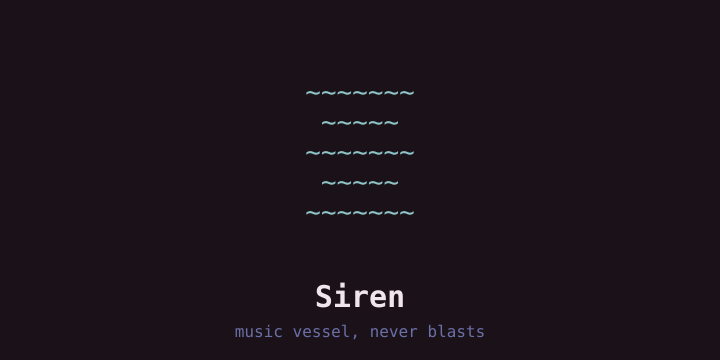
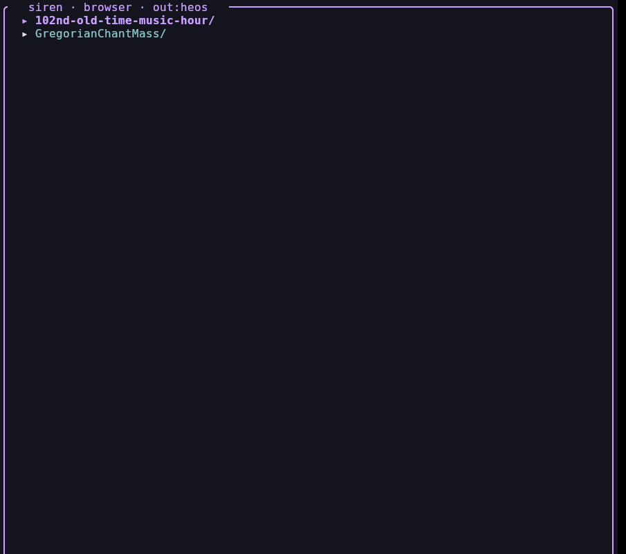
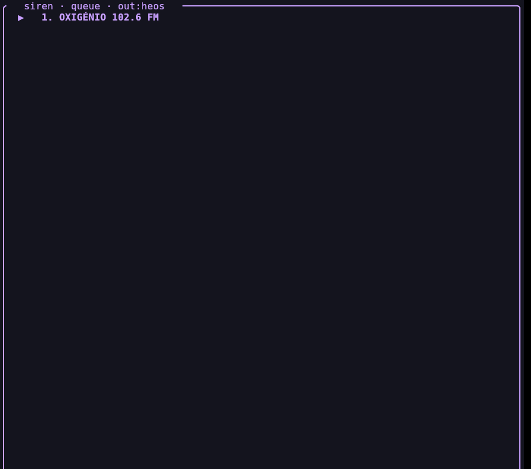

# Siren — the Aether's music vessel 🎵

faeOS first-party media player. mpv-backed local playback plus HEOS
network-speaker control, in one remote.

**Status:** default engine (v0.1.0, cut over 2026-09-23). Ported: config,
library/fuzzy, mpv IPC, queue/playlist, transport CLI, two-box TUI,
audio menu + `cast`, trove (CLI + TUI), tags (`ffprobe`), directory
browser — all live-verified. `~/bin/siren` is the thin launcher.
Python `faeOS/bin/siren` is archived (tests/rollback only).

## Look




```
~~~~~~~
 ~~~~~ 
~~~~~~~
 ~~~~~ 
~~~~~~~
```

## Layout

- `src/` — rust engine (`cargo build --release`)
- `scripts/siren` — thin launcher (never a prebuilt ELF in git)
- `build.sh install` — engine → `~/.local/lib/faeos/siren`, launcher → `~/bin/siren`

## TUI

Two boxes + a persistent waves strip. Top = content view (Tab cycles
browser → queue → audio → trove → radio). Bottom = context menu of the
focused view. Waves strip shows speaker state + 3-row spectrum (local
files) or `· live stream ·` (radio). Press `h` for help overlay.

**Consistent keys across all views:**

| Key | Action |
|-----|--------|
| `c` | cast to speaker |
| `d` | delete/remove |
| `s` | search |
| `m` | mute toggle |
| `a` | add |
| `f` | favorite |
| `h` | help overlay |

**View-specific keys** (uppercase = variant):

| View | Keys |
|------|------|
| browser | `enter` open · `a` add · `c` cast · `⌫` up · `/` filter · `S` save · `L` load · `R` rm |
| queue | `enter` play-from · `d` remove · `C` clear |
| audio | `o` output · `S` speaker · `r` repeat · `p` pause · `v` refresh · `t` test · `m` mute · `g` group · `u` ungroup · `G` group mute · `,`/`.` group vol |
| trove | `s` search · `enter` vers · `D` dl · `M` more · `A` all · `F` format |
| radio | `enter` play · `C` country · `s` search · `f` fav · `A` add url · `M` more |

**Group control** (audio view): `g` groups all speakers under current
speaker as leader, `u` ungroups, `G` toggles group mute, `,`/`.` adjust
group volume. HEOS natively syncs grouped speakers — verified 1–2ms
drift.

**Mixer** (audio view): every live source listed with app, volume,
muted state. `j/k` select, `m` mute/unmute one source, `-/+` adjust its
volume. The loopback is filtered out (infrastructure, not a source).

**Radio honesty**: favorites play their own saved URL first (direct
`play_stream`), TuneIn only as fallback. Playback is verified by
polling speaker state — dead streams report failure instead of fake
success. HTTP URLs are pre-checked; HTTPS passes through (no TLS
in std).

**Loading cue** (`tui.rs` `start_play`/`poll_play`): play is an async
job thread, single-flight, harvested on the UI tick. Spinner `|/-\`
in the bottom status line while running — **never the waves strip**
(reserved for the visualizer). **Never poll 1255 in a loop**: this
firmware wedges its CLI under rapid requests; verify via UPnP 60006.

**Visualizer** (`viz.rs`, `V` view): live FFT from the PipeWire
monitor (`stream.rs::capture_source`), so it follows real audio —
not file-decoded. **Latency**: `HOP`=256 slides the window (11.6ms
updates) while `WINDOW`=2048 keeps frequency resolution; the event
loop renders at 60fps only while `animating()` (Viz view, live
spectrum, or a play job) and falls back to a 500ms tick otherwise —
CPU stays proportional to visible motion. Network polls never run
at frame rate. Braille packer (2×4 dots/cell) is pure + tested.
Orientations: `render_horizontal` (bars up) / `render_vertical`
(bars right). `t`/`space` flips, `V` zooms 1×/2×/3×. Smoothing is
attack-fast/release-slow; peak caps tick down. Waves strip carries
a compact horizontal braille spectrum.

**Live stream** (audio view, `W`): siren captures the `Siren_Master`
null sink (the PipeWire default — every client lands there), encodes
mp3 via ffmpeg, serves it on `:8899/siren.mp3`, and feeds the group
leader over UPnP `SetAVTransportURI`. Members follow via group sync.
No TuneIn, no Denon servers — one local stream, both speakers, in sync.

## Audio

Siren owns its audio routing (`~/.config/siren/config.json`):

**Group mode** (new): `g` in audio view groups all HEOS speakers.
HEOS handles sync natively. Verified: 1–2ms drift between speakers.

```
siren audio                  # output, speaker, volumes, DLNA status
siren audio output heos      # route play/pause/next/now to the speaker
siren audio output local     # back to mpv (default)
siren cast <query>           # top library match → Vanguarda Office (DLNA)
siren audio queue              # speaker queue: qid · song — artist
siren audio queue play 2       # play / rm / clear / move 1 3
siren cast QUERY --next        # queue play-next (aid=2)
siren cast QUERY --append      # add to end (aid=3)
siren queue add QUERY          # local queue persists (~/.config/siren/queue.json)
```

Default speaker: **Vanguarda Office** (HEOS 1, `192.168.8.184`), `--speaker`
for Cave. Protocol: HEOS CLI on TCP/1255 (newline `heos://` URIs) +
`VANGUARDA-DLNA` (minidlna on `:8200`); queue via `add_to_queue aid=1`
with raw `$` in cid/mid.

## Trove

Free & legal music (Internet Archive + ccMixter), zero new Rust deps (system `curl`):

```
siren trove music lofi      # 20, then [m] more (infinite scroll)
siren trove live grateful   # Live Music Archive (etree)
siren trove ccmixter lofi   # ccMixter remixes (needs Referer, handled)
siren trove get <identifier>
siren trove about
```

TUI: 4th Tab stop (`trove`), `s` search · `enter` pick version · `d`
download cursor · `j/k` + auto-prefetch near the end · `m` more · `a`
all (double-press) · `f` session format · mouse wheel + click select,
double-click acts. Search, metadata and downloads run in background
threads.

## Radio

Community stations (radio-browser.info, keyless), same output channel
as music — local mpv or speaker `play_stream`:

```
siren radio countries         list countries (a-z)
siren radio stations Portugal stations for a country
siren radio search lofi       search by name
siren radio play <words>      play top match
siren radio fav               list favorites
siren radio fav <words>       toggle favorite
```

TUI: 5th Tab stop (`radio`). `Enter` with no country opens the country
picker (a-z, cached a week); `Enter`/`d` plays the cursor row, `c`
re-picks country, `s` searches, `f` toggles favorite (★ pinned on top),
`A` favorites any stream URL, `m` more. Favorites + last country persist
in `~/.config/siren/radio.json`. Streams ride the queue as URL items
(station name as label). Speaker radio rides TuneIn (no login): raw-URL
`play_stream` won't hold on this unit (verified dead 5 ways), but
`browse/play_stream` with a TuneIn `mid` sustains — output maps the
station name to TuneIn live. Local radio is plain mpv.
Guards: `.part` resume, skip-if-exists, 40-file cap, 32MB confirm,
`TROVE_MAX_TOTAL`. Lands in `~/Music/trove/<identifier>`.

## Build

```bash
./build.sh          # debug-check: cargo build --release
./build.sh install  # engine + launchers
```
